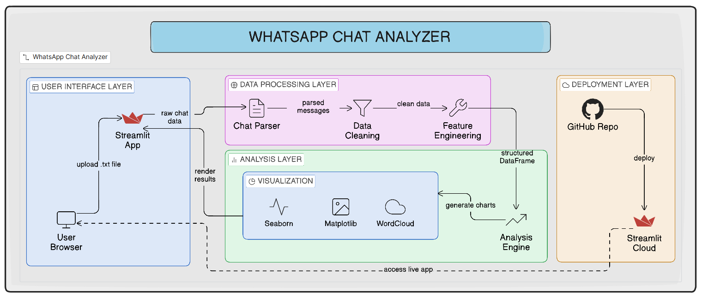
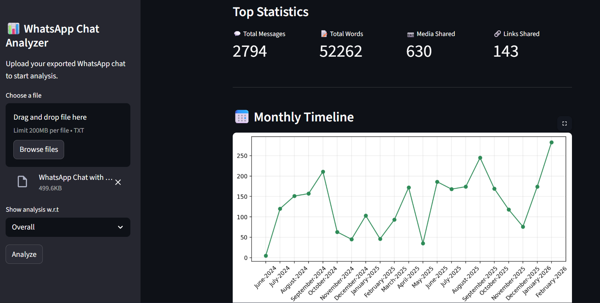

Perfect. We’ll keep the same **professional structure**, but this time focused completely on **data analysis + visualization using Python & Streamlit**, not business intelligence storytelling.

Here’s your **production-level README** for the WhatsApp Chat Analyzer:

---

# WhatsApp Chat Analyzer

## Interactive Data Analysis & Visualization Web Application

---

## 📌 Project Overview

The WhatsApp Chat Analyzer is a data analysis and visualization project built to extract meaningful insights from exported WhatsApp conversations.

The objective of this project is to transform unstructured chat text data into structured analytical outputs and interactive visualizations using Python-based data processing techniques.

The complete workflow covers text preprocessing, feature extraction, statistical analysis, and dynamic visual reporting through a Streamlit web interface.

---

## 📈 Application Preview

### System Workflow



### Dashboard Interface



---

## 🎯 Problem Statement

WhatsApp conversations contain valuable behavioral and interaction data, but the exported chat file is raw and unstructured.

The challenge was to:

* Clean and structure raw text chat data
* Extract meaningful statistical metrics
* Identify temporal activity trends
* Analyze word frequency patterns
* Measure emoji usage distribution
* Build an interactive analytical interface

This project focuses on transforming conversational data into quantitative insights through automated data analysis pipelines.

---

## 📊 Dataset

* Format: `.txt` (Exported WhatsApp Chat File)
* Type: Semi-structured conversational text data
* Source: User-exported WhatsApp conversations
* Includes: Timestamp, User Name, Message Content

Note: No dataset is stored in this repository for privacy reasons.

---

## ⚙️ Tools & Technologies Used

* **Python** – Core programming language
* **Pandas** – Data cleaning, transformation, aggregation
* **Matplotlib** – Statistical plotting and trend analysis
* **Seaborn** – Advanced data visualizations (heatmaps, distributions)
* **WordCloud** – Text frequency visualization
* **Regular Expressions (re)** – Text parsing and preprocessing
* **Streamlit** – Interactive web application deployment

---

## 🧱 Workflow Architecture

Raw Chat (.txt)
→ Text Preprocessing & Parsing
→ DataFrame Structuring (Pandas)
→ Feature Engineering (Dates, Users, Metrics)
→ Statistical Computation
→ Data Visualization (Matplotlib / Seaborn)
→ Interactive Dashboard (Streamlit)

---

## 📊 Analytical Features Implemented

* Total Messages, Words, Media & Links Count
* Monthly & Daily Activity Timelines
* Weekday and Monthly Activity Distribution
* Activity Heatmap (Time vs Day Analysis)
* Most Active Users (Group Chats)
* Word Frequency Analysis
* WordCloud Visualization
* Emoji Usage Distribution

---

## 📂 Project Structure

* `app.py` → Main Streamlit Application
* `preprocessor.py` → Chat Parsing & Data Cleaning
* `helper.py` → Statistical Calculations & Analysis Functions
* `requirements.txt` → Dependencies
* `images/` → Screenshots and architecture diagrams

---

## ▶ How to Run the Application

1. Clone the repository:

```
git clone https://github.com/<your-username>/whatsapp-chat-analyzer.git
```

2. Install dependencies:

```
pip install -r requirements.txt
```

3. Run the Streamlit app:

```
streamlit run app.py
```

4. Export your WhatsApp chat (Without Media) and upload the `.txt` file in the sidebar.

---

## 💡 Key Learning Outcomes

* Practical implementation of text preprocessing using Python
* Structuring semi-structured data into analyzable formats
* Feature engineering on time-series conversational data
* Statistical data aggregation using Pandas
* Building production-style interactive dashboards
* Deploying Python-based analytical web applications

---

## 🔗 Important Links

🚀 **Live Streamlit Application**
Access the deployed app here:
[Add Streamlit Deployment Link Here]

📖 **Medium Blog (Detailed Project Explanation)**
Read the full case study here:
[Add Medium Blog Link Here]

📊 **Project Presentation (PPT Slides)**
View the presentation slides here:
[Add Presentation Link Here]

🎥 **YouTube Walkthrough (Application Demo & Explanation)**
Watch the full project demo here:
[Add YouTube Demo Link Here]


---
